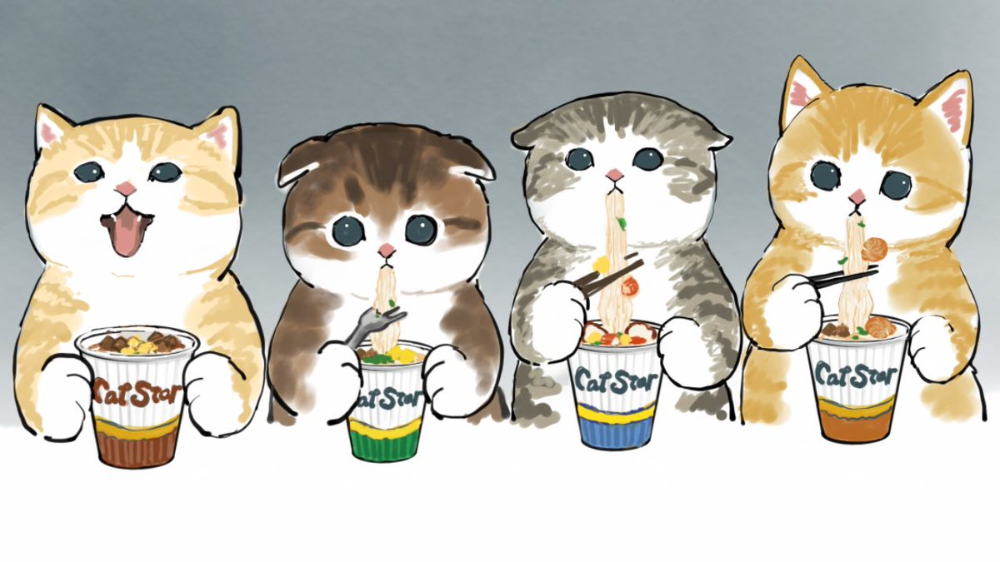
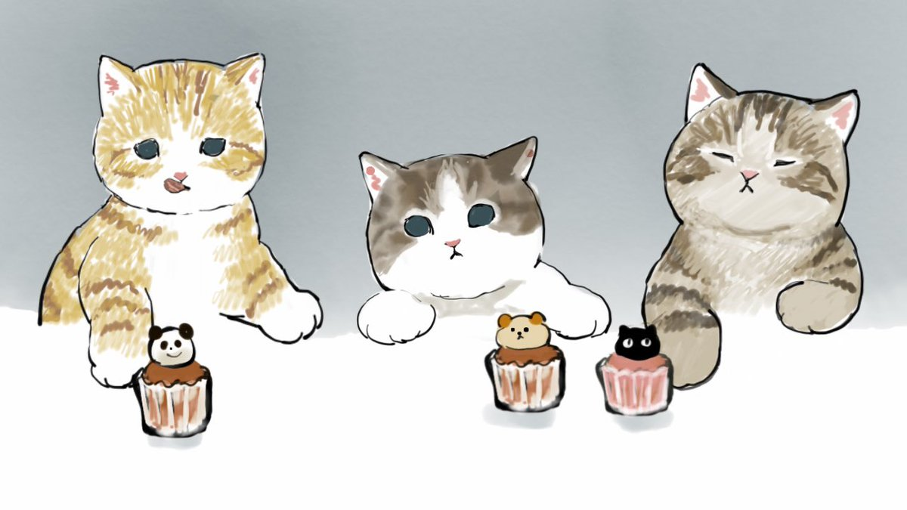

# Hello there! 👋
**I'm Adrian** :octocat:

- I`m Python-Developer!
- My best project is [MinePort][portes] !
- I also write my own [russifiers][steam] for Linux-games!

    
<b></b>More information<b> ^^

    

    
    

[portes]: htpps://github.com/maccree/MinePort
[steam]: https://steamcommunity.com/id/pr1nce55/myworkshopfiles/?section=guides
